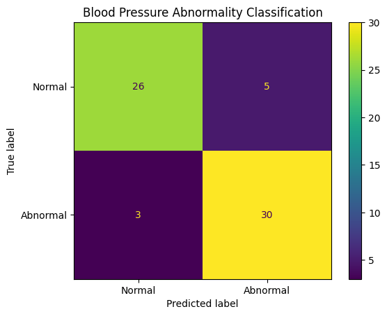

# Blood Pressure Abnormality Prediction

This project predicts whether a patient has abnormal blood pressure using clinical
and lifestyle features. The dataset is sourced from Kaggle.

## Models Used
- Logistic Regression
- Random Forest Classifier

## Results

### Feature Importance (Random Forest)

---

| Confusion Matrix (Random Forest) | Model Accuracy Comparison |
|---------------------------------|---------------------------|
|  |  |

## Accuracy Summary
- Logistic Regression Accuracy: 0.75
- Random Forest Accuracy: 0.875

## Dataset
Kaggle – Blood Pressure Dataset

## Model Insights
- Random Forest outperformed Logistic Regression due to its ability to model non-linear relationships among physiological features.
- Ensemble learning allowed better handling of feature interactions and variance in the dataset.
